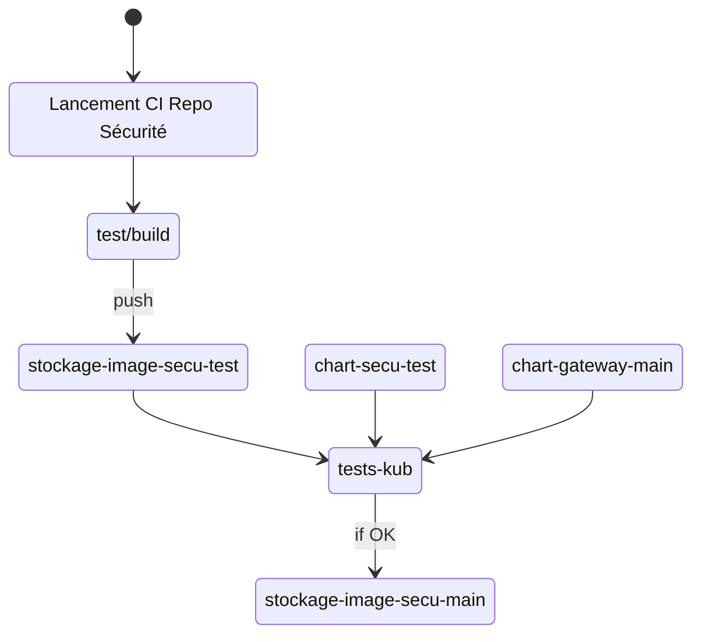

Idee: le flow de la ci des microservice

```mermaid
stateDiagram
    state "Lancement CI Repo Sécurité" as A
    state "test/build" as B
    state "stockage-image-secu-test" as C
    state "tests-kub" as D
    state "chart-secu-test" as E
    state "chart-gateway-main" as F
    state "stockage-image-secu-main" as G
    [*] --> A
    A-->B
    B-->C: push
    C-->D
    E-->D
    F-->D
    D-->G : if OK
```