# ⚙️ Installation des services pour l'environment de développement - Zone Infra

---
    
## 📜 Introduction
Pour simplifier la configuration et l’installation de l’environnement de développement de **VisioBook**, nous utilisons un **Makefile**.  
Ce fichier permet d’automatiser certaines tâches comme l’installation des dépendances, la création des conteneurs ou la mise en place des configurations nécessaires pour travailler sur le projet.

Grâce à la commande unique :

```bash
  make setup
```
✅ Tous les outils et dépendances sont installés sans que le développeur ait à exécuter plusieurs commandes manuelles.

---

## 📝 Qu’est-ce qu’un Makefile ?
Un Makefile est un fichier texte qui contient des règles (ou recipes) permettant d’automatiser des tâches.
Il est utilisé avec l’outil make, souvent présent par défaut sur macOS et Linux (et installable facilement sur Windows via WSL ou Git Bash).

👉 Pourquoi utiliser un Makefile dans VisioBook ?
* ✅ Centraliser les commandes de configuration du projet
* ✅ Faciliter l’installation pour les nouveaux développeurs
* ✅ Éviter les erreurs liées à des commandes manuelles répétitives
* ✅ Uniformiser l’environnement de travail de toute l’équipe
---
## 🔧 Outils installés par make setup

La commande make setup va installer et configurer tous les outils nécessaires au développement Kubernetes de VisioBook :
* **kubectl** → L’outil en ligne de commande pour interagir avec le cluster Kubernetes
* **minikube** → Un cluster Kubernetes local pour tester l’application
* **helm** → Le gestionnaire de packages pour Kubernetes (permet d’installer facilement des services comme des bases de données ou des ingress)
* **ArgoCD** → L’outil GitOps utilisé pour gérer les déploiements continus de VisioBook
* **k9s** → L’interface CLI pour explorer et administrer facilement les ressources Kubernetes
---
## 🚀 Mise en place de l’environnement
### 🔧 1. Prérequis
Avant de lancer la commande make setup, assure-toi d’avoir :
* 📂 Le dépôt doit être stocké sous un utilisateur non-root.
* 👤 Toutes les commandes doivent être exécutées avec un utilisateur non-root.
  * Vérifiable via la commande : `whoami`
* 🐳 **Docker** doit être installé sur la machine.
  * [Installation de Docker](#installdocker)
* 🔧 L’utilisateur utilisé doit faire partie du groupe **docker**.
  * Vérifiable via la commande : `groups`.
  * Ou en s'ajoutant au groupe via la commande suivante : `sudo usermod -aG docker {utilisateur}`

### ▶️ 2. Installation de l’environnement
Avant d'exécuter la commande, vous devez vous placer dans le bon dossier et exécuter la commande :
```bash
    cd <racine du repo>/environnement/dev
    make setup
```
* La commande `make setup` a exécuté automatiquement plusieurs étapes :
  * **1 - Configuration de Minikube**
    * Supprime les anciens clusters (`minikube delete --all`)
    * Redémarre un nouveau cluster propre avec `minikube start`
    * Installe et configure Minikube via le script `install_minikube.sh`
  * **2 - Installation de Helm**
    * Lance le script `install_helm.sh` pour installer et configurer Helm, l’outil de gestion de packages pour Kubernetes.
  * **3 - Installation de K9s**
    * Installe K9s via `install_k9s.sh` pour permettre d’administrer et d’explorer le cluster Kubernetes depuis le terminal.
  * **4 - Installation de ArgoCD**
    * Lance `install_argocd.sh` pour déployer ArgoCD, l’outil GitOps qui gère les déploiements continus de l’application.
  * **5 - Installation de ArgoCD Image Updater**
    * Exécute `install_argo_image_updater.sh` pour installer le module complémentaire qui met automatiquement à jour les images Docker dans le cluster.
---
### 📊 Workflow du Makefile

```mermaid
flowchart LR
    A[Développeur lance<br> `make setup`] --> B[setup-minikube<br>📥 Installe Minikube]
    B --> C[clean-minikube<br>🧹 Supprime et redémarre Minikube]
    C --> D[setup-helm<br>⛵ Installe Helm]
    D --> E[setup-k9s<br>🖥 Installe K9s]
    E --> F[setup-argocd<br>🚀 Installe ArgoCD]
    F --> G[setup-argocd-image-updater<br>⚙️ Installe ArgoCD Image Updater]
    G --> H[✅ Environnement prêt !]
```

### 📄 Structure du Makefile

Voici un aperçu des principales cibles du Makefile :
```bash
    setup:
	@echo "Configuration de l'environnement de développement..."
	@$(MAKE) setup-minikube
	@$(MAKE) clean-minikube
	@$(MAKE) setup-helm
	@$(MAKE) setup-k9s
	@$(MAKE) setup-argocd
	@$(MAKE) setup-argocd-image-updater


clean-minikube:
	@echo "Nettoyage de Minikube..."
	minikube delete --all && echo "Minikube a été nettoyé."
	minikube start && echo "Minikube a été démarré."

setup-minikube:
	./scripts/install_minikube.sh && echo "Minikube a été configuré."

setup-helm:
	./scripts/install_helm.sh && echo "Helm a été configuré."

setup-argocd:
	./scripts/install_argocd.sh && echo "ArgoCD a été installé."

setup-k9s:
	./scripts/install_k9s.sh && echo "K9s a été installé."

setup-argocd-image-updater:
	./scripts/install_argo_image_updater.sh && echo "Argocd Image Updater a été installé."

```
